<div align="center">

# Vault App

**A privacy-first, offline password manager for Android**

[](https://developer.android.com)
[](https://kotlinlang.org)
[](https://developer.android.com/jetpack/compose)
[](LICENSE)
[](https://android-arsenal.com/api?level=26)

</div>

---

Vault is a fully offline, security-focused credential manager built with modern Android development practices. Designed for users who prioritize privacy and data sovereignty, it operates entirely on-device without any cloud synchronization, telemetry, or external network calls. All sensitive data is encrypted using industry-standard AES-256-GCM encryption, with cryptographic keys protected by Android Keystore and user-defined passphrases. The application supports multiple credential types including standard accounts, social media profiles, cryptocurrency wallets, and Google accounts with comprehensive field support.

## Features

### Security & Encryption

- **AES-256-GCM Encryption** - Military-grade encryption for all stored credentials
- **BIP-39 Passphrase Generation** - Cryptographically secure 12-word mnemonic passphrases
- **Data Encryption Key (DEK) Architecture** - Credentials encrypted with DEK, DEK wrapped with device KEK
- **Android Keystore Integration** - Hardware-backed key storage when available
- **PBKDF2-HMAC-SHA256 Key Derivation** - 310,000 iterations for passphrase-based key derivation
- **Zero-Knowledge Design** - Passphrase never stored on device

### Authentication

- **6-Digit PIN** - Quick access with bcrypt-hashed PIN (12 rounds)
- **Biometric Authentication** - Fingerprint/Face unlock support via AndroidX Biometric
- **Auto-Lock on Background** - Immediate vault lock when app loses focus
- **Screen-Off Lock** - Automatic lock when device screen turns off
- **Idle Timeout** - 5-minute inactivity auto-lock
- **Screenshot Prevention** - FLAG_SECURE prevents screen capture

### Credential Management

- **Multiple Credential Types**:
  - Standard (username, password, email, notes)
  - Social Media (with phone, 2FA, recovery options)
  - Crypto Wallet (private key, seed phrase)
  - Google Account (full recovery field support)
- **Platform Organization** - Group credentials by service/platform
- **Custom Platforms** - Create custom platforms with icons and colors
- **Secure Field Encryption** - Individual encryption for sensitive fields
- **Edit Cooldown** - 24-hour protection against rapid credential changes

### Backup & Portability

- **Encrypted Export** - Password-protected `.zip` backup with `vault.enc`
- **Cross-Device Import** - Portable backup format compatible across devices
- **Backup Preview** - View backup statistics before importing
- **Passphrase Verification** - Validate passphrase before export/import operations

### User Experience

- **Material Design 3** - Modern, clean UI with dynamic theming
- **Dark Mode Support** - System-aware theme switching
- **Offline-First** - 100% functionality without internet connection
- **No Analytics** - Zero telemetry, tracking, or data collection

---

## Architecture

### Tech Stack

| Layer            | Technology                     |
| ---------------- | ------------------------------ |
| **UI**           | Jetpack Compose, Material 3    |
| **Architecture** | MVVM, Clean Architecture       |
| **DI**           | Hilt (Dagger)                  |
| **Database**     | Room with encrypted fields     |
| **Async**        | Kotlin Coroutines, Flow        |
| **Security**     | Android Keystore, BouncyCastle |
| **Navigation**   | Navigation Compose             |

### Encryption Flow

- VAULT ENCRYPTION ARCHITECTURE


- CREDENTIAL ENCRYPTION

```mermaid
flowchart TD
    A("Password (Plaintext)") --> D("DEK · AES-256-GCM")
    B("Notes (Plaintext)") --> D
    C("Private Key (Plaintext)") --> D

    D --> E("Nonce (12B) + Ciphertext + Auth Tag (Stored)")

```



### Export File Format (vault.enc)

| Offset (hex) | Field          | Description                      | Size |
| ------------ | -------------- | -------------------------------- | ---- |
| 0x00         | Magic Number   | ASCII "VLT1"                     | 4 B  |
| 0x04         | Version        | 0x01                             | 1 B  |
| 0x05         | KDF Type       | 0x01 = PBKDF2                    | 1 B  |
| 0x06         | Salt           | Cryptographically secure random  | 32 B |
| 0x26         | Nonce          | Random bytes (AEAD nonce)        | 12 B |
| 0x32         | Ciphertext Len | Big-endian integer               | 4 B  |
| 0x36         | Ciphertext     | Encrypted JSON + Auth Tag (AEAD) | Var  |

Notes:

- Uses AEAD cipher (AES-GCM or ChaCha20-Poly1305)
- Authentication tag is embedded in ciphertext
- All sensitive data encrypted via DEK derived from passphrase

---

#### 📦 Backup ZIP Structure


metadata.json contains:

- Vault version
- Entry count
- Created / updated timestamp
- App build info

Security guarantees:

- Zero-knowledge: passphrase loss = permanent data loss
- Metadata is intentionally plaintext and safe to expose
- Container format is forward-compatible for future versions

### Session & Lock Flow

```mermaid
flowchart TD
  %% ─────────────────────────────────────────────────────────────
  %% SESSION LIFECYCLE (Modern Mermaid / GitHub-friendly)
  %% ─────────────────────────────────────────────────────────────

  A["🚀 App Launched"]:::entry --> B{"🗄️ Vault exists?"}:::decision

  B -->|No| C["🧩 Setup Screen<br/>(Create Vault)"]:::action
  B -->|Yes| D["🔐 Unlock Screen<br/>(PIN / Biometric)"]:::auth

  C --> E["✅ UNLOCKED<br/>(DEK in memory)"]:::unlocked
  D --> E

  %% Lock triggers
  E --> T{"⏳ Lock trigger?"}:::decision
  T -->|📴 Screen Off| S1["📴 Screen Off"]:::trigger
  T -->|🧊 Background| S2["🧊 Background"]:::trigger
  T -->|🕔 Idle ≥ 5 min| S3["🕔 Idle ≥ 5 min"]:::trigger

  S1 --> L["🔒 LOCKED<br/>(DEK cleared)"]:::locked
  S2 --> L
  S3 --> L

  %% Re-auth flow
  L --> R["♻️ Re-authenticate<br/>(PIN / Biometric)"]:::auth
  R --> E

  %% Optional: clearly show that vault creation leads to unlock gate too
  C -. "Vault created" .-> D

  %% ─────────────────────────────────────────────────────────────
  %% Styling
  %% ─────────────────────────────────────────────────────────────
  classDef entry fill:#0ea5e9,color:#0b1220,stroke:#0284c7,stroke-width:2px;
  classDef decision fill:#111827,color:#e5e7eb,stroke:#374151,stroke-width:2px;
  classDef action fill:#a78bfa,color:#0b1220,stroke:#7c3aed,stroke-width:2px;
  classDef auth fill:#f59e0b,color:#0b1220,stroke:#d97706,stroke-width:2px;
  classDef unlocked fill:#22c55e,color:#052e16,stroke:#16a34a,stroke-width:2px;
  classDef trigger fill:#64748b,color:#0b1220,stroke:#475569,stroke-width:2px;
  classDef locked fill:#ef4444,color:#0b1220,stroke:#dc2626,stroke-width:2px;

  %% Assign classes (explicit, GitHub-safe)
  class A entry;
  class B,T decision;
  class C action;
  class D,R auth;
  class E unlocked;
  class S1,S2,S3 trigger;
  class L locked;
```



---

## Building

### Prerequisites

- **Android Studio** Hedgehog (2023.1.1) or later
- **JDK 17** or later
- **Android SDK** with API level 34
- **Gradle 8.10+** (included via wrapper)

### Clone Repository

```bash
git clone https://github.com/motebaya/vault-app-mobile.git
cd vault-app-mobile
```

### Development Build

Build a debug APK for testing and development:

```bash
# Using Gradle wrapper
./gradlew assembleDebug

# Output location
# app/build/outputs/apk/debug/app-debug.apk
```

Install directly to connected device:

```bash
./gradlew installDebug
```

### Production Build

Build a release APK with ProGuard optimization using the automated build scripts:

#### Using Build Scripts (Recommended)

**Windows (PowerShell):**

```powershell
# First time setup - Generate keystore
.\build_prod.ps1 -GenerateKeystore

# Build release APK
.\build_prod.ps1 -BuildRelease

# Clean and build
.\build_prod.ps1 -Clean -BuildRelease

# Show help
.\build_prod.ps1 -Help
```

**Linux/macOS (Bash):**

```bash
# Make script executable (first time only)
chmod +x build_prod.sh

# First time setup - Generate keystore
./build_prod.sh --generate-keystore

# Build release APK
./build_prod.sh --release

# Clean and build
./build_prod.sh --clean --release

# Show help
./build_prod.sh --help
```

The build scripts will:

- Guide you through keystore generation with interactive prompts
- Create `keystore.properties` with signing credentials (auto-ignored by git)
- Build signed release APK with proper configuration
- Display APK size and location after successful build

**Output location:** `app/build/outputs/apk/release/app-release.apk`

#### Manual Method

If you prefer to configure signing manually:

```bash
# Create signing key (first time only)
keytool -genkey -v -keystore vault-release.jks -keyalg RSA -keysize 2048 -validity 10000 -alias vault

# Create keystore.properties file
cat > keystore.properties << EOF
storeFile=vault-release.jks
storePassword=your_password
keyAlias=vault
keyPassword=your_password
EOF

# Build release APK
./gradlew assembleRelease

# Output location
# app/build/outputs/apk/release/app-release.apk
```

**Important:** Never commit `keystore.properties` or `vault-release.jks` to version control. These files are already in `.gitignore`.

### Build Variants

| Variant   | Minification | Debuggable | Use Case                |
| --------- | ------------ | ---------- | ----------------------- |
| `debug`   | Disabled     | Yes        | Development & Testing   |
| `release` | R8/ProGuard  | No         | Production Distribution |

### Running Tests

```bash
# Unit tests
./gradlew test

# Instrumented tests (requires device/emulator)
./gradlew connectedAndroidTest
```

---

## Project Structure

```
vault-native/
├── app/
│   ├── src/main/
│   │   ├── java/com/vaultapp/
│   │   │   ├── data/
│   │   │   │   ├── local/          # Room database, DAOs, entities
│   │   │   │   ├── repository/     # Repository implementations
│   │   │   │   └── session/        # Session management
│   │   │   ├── domain/
│   │   │   │   ├── entity/         # Domain models
│   │   │   │   └── repository/     # Repository interfaces
│   │   │   ├── presentation/
│   │   │   │   ├── components/     # Reusable UI components
│   │   │   │   ├── navigation/     # Navigation graph
│   │   │   │   ├── screens/        # Screen composables & ViewModels
│   │   │   │   └── theme/          # Material 3 theming
│   │   │   ├── security/
│   │   │   │   ├── container/      # Vault.enc format handling
│   │   │   │   ├── crypto/         # Encryption services
│   │   │   │   ├── hardening/      # Security hardening
│   │   │   │   └── keystore/       # Android Keystore wrapper
│   │   │   ├── util/               # Utility functions
│   │   │   ├── MainActivity.kt     # Single activity
│   │   │   └── VaultApplication.kt # Application class
│   │   └── res/                    # Resources
│   └── build.gradle.kts            # App-level build config
├── gradle/
│   └── libs.versions.toml          # Version catalog
├── build.gradle.kts                # Project-level build config
├── settings.gradle.kts             # Project settings
└── README.md                       # This file
```

---

## Security Considerations

### What We Do

- All sensitive data encrypted with AES-256-GCM before storage
- Cryptographic keys stored in Android Keystore (hardware-backed when available)
- Passphrase never persisted - only used transiently for key derivation
- PIN hashed with bcrypt (12 rounds) - never stored in plaintext
- Automatic memory clearing of sensitive data after use
- FLAG_SECURE prevents screenshots and screen recording
- ProGuard/R8 obfuscation in release builds

### What We Don't Do

- No cloud sync or remote storage
- No analytics, telemetry, or crash reporting
- No third-party SDKs with network access
- No clipboard persistence of sensitive data
- No logging of sensitive information in release builds

### Threat Model

| Threat            | Mitigation                                           |
| ----------------- | ---------------------------------------------------- |
| Device theft      | Auto-lock, PIN/biometric required, encrypted storage |
| Shoulder surfing  | Password masking, screenshot prevention              |
| Memory dump       | DEK cleared on lock, sensitive data zeroed after use |
| Backup extraction | Backups encrypted with user passphrase               |
| App downgrade     | Database version guard prevents data corruption      |

---

### Code Style

- Follow [Kotlin Coding Conventions](https://kotlinlang.org/docs/coding-conventions.html)
- Use meaningful commit messages
- Add KDoc comments for public APIs
- Write unit tests for new functionality

## Acknowledgments

- [Jetpack Compose](https://developer.android.com/jetpack/compose) - Modern Android UI toolkit
- [BouncyCastle](https://www.bouncycastle.org/) - Cryptographic library
- [jBCrypt](https://www.mindrot.org/projects/jBCrypt/) - BCrypt implementation for Java
- [Material Design 3](https://m3.material.io/) - Design system

## License

This project is licensed under the MIT License - see the [LICENSE](LICENSE) file for details.

<div align="center">

_Built with 🍵 by [Mochino](https://t.me/dvinchii)_

</div>
